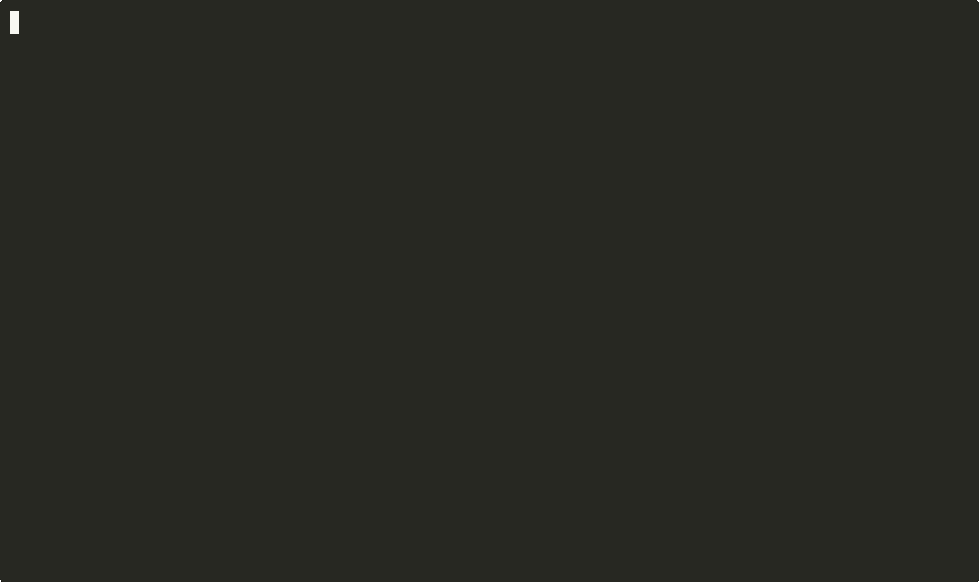

<p align="center">
  <h1 align="center">CW</h1>
  <p align="center">
    <strong>Claude Workspace Manager</strong>
    <br />
    Multi-project orchestrator for coding agents — <a href="https://docs.anthropic.com/en/docs/claude-code">Claude Code</a>, Codex CLI, Pi and OpenCode
  </p>
  <p align="center">
    <a href="LICENSE"></a>
    <a href="#requirements"></a>
    <a href="#requirements"></a>
  </p>
  <p align="center">
    <a href="#quick-start">Quick Start</a> &middot;
    <a href="#harnesses">Harnesses</a> &middot;
    <a href="#core-commands">Commands</a> &middot;
    <a href="#how-it-works">How It Works</a> &middot;
    <a href="docs/commands.md">Full Reference</a> &middot;
    <a href="docs/architecture.md">Architecture</a>
  </p>
</p>

---

One command. Right account. Right agent. Isolated worktree. Full context.

```bash
cw work my-app https://github.com/org/my-app/issues/42
```

CW picks the project's account and coding agent, puts the issue into `TASK_NOTES.md`, and launches the agent on the task — and resumes it later where it left off.

<p align="center">
  
</p>

---

## Quick Start

```bash
# Install
git clone https://github.com/avarajar/cw.git && cd cw && ./install.sh

# Setup
cw init
cw account add work
cw account login work --harness claude
cw project register ~/code/my-app --account work

# Go
cw work my-app fix-auth
```

## Why CW?

Working with a coding agent across several projects means juggling a config directory per account, losing context when a conversation expires, fighting branch conflicts when you review a PR in the middle of a task, and pasting ticket descriptions by hand. Using more than one agent makes it worse: every CLI keeps its credentials and sessions somewhere different.

CW handles all of it:

```
cw create "Task management SaaS"          →  new project, the agent builds it
cw work my-app PROJ-123                   →  worktree + ticket context + right account
cw work my-app PROJ-123 --harness codex   →  the same flow on Codex CLI
cw review my-app 42                       →  PR review in its own session
cw work my-app PROJ-123                   →  resume where you left off
cw work my-app PROJ-123 --done            →  clean up the worktree, archive the session
```

## Harnesses

A *harness* is the coding-agent CLI a session runs on. CW ships a driver for four of them:

| Harness | Tested against |
|---|---|
| `claude` — Claude Code | the real CLI; this is the default |
| `codex` — Codex CLI | recording fakes only |
| `pi` | recording fakes only; the driver rests mostly on documentation |
| `opencode` | recording fakes only |

**Only Claude Code has been run against a real binary.** Treat the other three as reviewed rather than field-proven until they have been run for real. `cw harness list` shows which ones are installed on your machine.

### Choosing one

A session always resumes on the harness it started on. If you pass a different one, CW refuses rather than switch agents mid-task. For a new session, the first match wins:

1. `--harness <h>` on the command, or the `CW_HARNESS` environment variable
2. the project's `harness`, set with `cw project register <path> --harness <h>`
3. the account's default harness, set when the account is created: `cw account add <name> --harness <h>`
4. `claude`

Accounts, projects and sessions created before 0.3.0 have no harness set, so they keep running on Claude Code, exactly as before.

```bash
cw work my-app fix-auth                    # the project's or the account's harness
cw work my-app fix-auth --harness codex    # this task on Codex CLI
```

### Accounts, providers and models

An account holds one set of credentials per harness. It can also carry a provider and a model, so free, local and third-party models work too:

```bash
cw account add glm   --harness opencode --provider zai    --model glm-5.1
cw account add local --harness opencode --provider ollama --model qwen3-coder:14b   # no login needed
cw account login work --harness codex
```

Codex and OpenCode apply a non-native provider. Claude Code and Pi don't, so CW refuses to launch them with one rather than silently ignore it.

`cw account login` runs the harness's own login against the account's credentials. Two options work on Codex only: `--no-browser` prints a login URL and a device code instead of opening a browser, and `--with-api-key -` reads an API key from stdin. The other harnesses log in through their own interactive screen.

### What depends on the harness

Some features belong to one harness. On another, CW skips them with a one-line notice, or refuses when the command makes no sense without them:

| Feature | Harnesses |
|---|---|
| `--skip-permissions`, agent teams (`--team`), hooks, plugins, statusline, skills | Claude Code |
| MCP connectors (`cw mcp`, `cw project setup-mcps`) | Claude Code |
| `cw loop`, which runs Claude Code's `/loop` | Claude Code |
| Login without a browser, API key on stdin | Codex |
| A third-party or local provider | Codex, OpenCode |

[docs/harness-drivers.md](docs/harness-drivers.md) lists the capabilities each driver declares, and explains how to write your own driver in `~/.cw/harnesses/`.

## Core Commands

### Create — Bootstrap a Project

```bash
cw create "Inventory management app with Next.js and Supabase"
cw create "CLI tool in Rust for monitoring" --account personal
cw create "E-commerce platform" --team                          # agent teams (Claude Code)
cw create "API gateway" --team "backend, infra, tests"          # custom team roles
cw create https://notion.so/team/Project-Spec --account work    # from a Notion spec
```

Creates the directory, initializes git, registers the project, and launches the agent to build it. When it's done, it asks which GitHub account or org to push to. A spec URL is read through Claude Code's MCP connectors; on another harness, the agent asks you to paste the spec.

### Work — Tasks in Isolated Worktrees

```bash
cw work my-app fix-auth                                # a branch name
cw work my-app fix-auth --workflow bugfix              # with a workflow template
cw work my-app PROJ-123 -w feature
cw work my-app https://linear.app/team/issue/PROJ-123  # Linear issue
cw work my-app https://github.com/org/repo/issues/42   # GitHub issue
cw work my-app https://notion.so/team/Auth-Redesign    # Notion page
cw work my-app fix-auth --harness codex                # on another harness

cw work my-app fix-auth                                # resume
cw work my-app fix-auth --done                         # close and clean up
```

Each task gets its own git worktree and a session that outlives the conversation. For a URL, CW fetches the ticket into `TASK_NOTES.md` before the agent starts — see [URL → Context](#url--context). The project root's `.env` and `.claude/` are linked into the worktree.

On Claude Code, the agent creates the worktree itself, as in earlier releases. On the other harnesses, CW creates it before launch and starts the agent inside it. It never deletes an existing branch, and if it can't create the worktree it says so and lets the agent do it.

#### Workflow Templates

The `--workflow` flag adds structured instructions for different kinds of work:

| Workflow | Use case |
|----------|----------|
| `feature` | New feature development with a design-first approach |
| `bugfix` | Bug fixes with a reproduce-first method |
| `refactor` | Safe refactoring with test-driven verification |
| `security-audit` | OWASP-based security review |
| `docs` | Documentation with an audience-first approach |

Workflow templates live in `~/.cw/templates/workflows/` and are fully customizable.

#### Shared Context

All worktrees in the same project share a `SHARED_CONTEXT.md` file, linked in automatically. When one task discovers something relevant to others — a schema change, an API change, a convention — the agent updates the shared context, and the other worktrees see it immediately.

### Agent Teams — Parallel Work (Claude Code, experimental)

```bash
cw work my-app big-feature --team                              # auto-split the work
cw work my-app big-feature --team "backend, frontend, tests"   # name the teammates
```

Uses Claude Code's [agent teams](https://code.claude.com/docs/en/agent-teams): several teammates work on different parts of the task at once, coordinating through a shared task list. The arcade dashboard shows each teammate's activity live. On another harness, `--team` is skipped with a notice.

> `cw create` also takes `--team` to bootstrap a project with agent teams.

### Plan — Auto-Split Tasks

```bash
cw plan my-app "migrate auth to OAuth2"
cw plan my-app "add payment processing with Stripe" --harness codex
```

Launches the agent to analyze the project, split the goal into 2–6 independent sub-tasks, and optionally create a worktree for each, with a suggested workflow template. Useful for large features that benefit from parallel work.

### Review — PR Reviews

```bash
cw review my-app 123                                   # by PR number
cw review my-app https://github.com/org/repo/pull/123  # by URL
cw review my-app 123                                   # re-review: checks requested changes
cw review my-app 123 --done                            # close
```

A review runs in the project directory, in its own session with a `REVIEW_NOTES.md`, without a worktree. The first review uses your project's review skill; follow-ups check whether the requested changes were made. With Claude Code and the activity hooks installed (`cw arcade --setup`), the session closes itself when the review is submitted.

### Loop — Recurring Sessions (Claude Code)

```bash
cw loop my-app "run the tests and fix breakage" --every 30m --name tests
cw loop my-app "keep an eye on the deploy" --name deploy          # self-paced
cw loop my-app tests --done                                        # close
```

Runs Claude Code's `/loop` on a fixed interval or at its own pace, in a session you can resume. It refuses on any other harness.

### Clean — Remove Stale Spaces

```bash
cw clean                # detect and remove stale worktrees and sessions
cw clean --dry-run      # preview what would be removed
cw clean --days 14      # set a custom inactivity threshold
cw clean --force        # skip the confirmation prompt
```

Finds worktrees and sessions that have been inactive beyond a threshold and cleans them up.

### Doctor — Health Check

```bash
cw doctor
cw doctor --json
```

Checks git and python3, which harnesses are installed, every account against every harness (connected, not logged in, not installed, or local), project paths, templates, stale sessions and orphaned worktrees. `--json` prints the same as one JSON object, for tools such as Forge.

### Stats — Session Metrics

```bash
cw stats                # all projects
cw stats my-app         # one project
```

Shows productivity metrics across sessions: total, active and done tasks, average opens per session, completion rate, duration of completed tasks, and a breakdown by workflow.

### Quick Access

```bash
cw open my-app          # open the project's agent in the project, no worktree
cw launch work          # open the account's agent, no project
cw spaces               # active tasks and reviews, with their harness
cw dashboard            # workspace overview in the terminal
cw forge                # visual dashboard (web UI)
```

`cw launch` takes its harness from `CW_HARNESS` (`CW_HARNESS=codex cw launch work`) and passes any other arguments straight to the agent.

## Accounts and Routing

Each project maps to an account, and each account can hold credentials for several harnesses. CW picks both for you:

```bash
cw account add work
cw account add personal --harness codex

cw project register ~/code/company-app  --account work
cw project register ~/code/side-project --account personal

cw work company-app feat-x      # → work account, Claude Code
cw work side-project feat-y     # → personal account, Codex CLI
```

`--account` on a command uses another account for that run.

Accounts created before 0.3.0 keep working as they are, with no migration. `cw account migrate <name>` optionally moves an old account's Claude files into `accounts/<name>/claude/`, the layout new accounts use. It has `--dry-run` and `--undo`.

## Arcade — Live Dashboard

```bash
cw arcade --setup       # install activity hooks (once)
cw arcade               # launch the live dashboard in a browser
```

A real-time dashboard of Claude Code sessions, tool use and agent activity across accounts. It streams activity with Server-Sent Events, with no polling.

`--setup` installs Claude Code hooks in all your accounts, and new accounts created with `cw account add` inherit them. Arcade and its hooks work with Claude Code only.

<!-- If you have a screenshot of the arcade dashboard, add it here:

-->

## Forge — Visual Dashboard

[Forge](https://github.com/avarajar/forge) is the full web dashboard for CW. Instead of `cw spaces` and `cw dashboard` in the terminal, you get a visual UI with multi-tab terminals, filters, project info and one-click actions.

```bash
cw forge              # launch the Forge dashboard in a browser
```


**Features:**
- Task list with filters by account, project and type (dev/review/design/plan)
- Multi-tab interactive terminals — several Claude Code sessions side by side
- Project info — detected stack, MCPs and plugins at a glance
- One-click start, resume and done for tasks and reviews
- Keyboard shortcuts (Cmd+1..5, Cmd+W, Cmd+L)

Forge launches Claude Code sessions; choosing a harness from Forge is planned.

**Install:**
```bash
npm i -g @forge-dev/platform    # install once
cw forge                        # launch any time
```

Or without installing: `npx @forge-dev/platform`

See the [Forge repo](https://github.com/avarajar/forge) for full docs and screenshots.

## How It Works

### Worktree Isolation

Every task gets its own [git worktree](https://git-scm.com/docs/git-worktree). No checkout conflicts, no stashing. Reviews and loops run in the project directory instead.

```
my-app/
├── src/                       # main branch (untouched)
└── .tasks/
    ├── fix-auth/              # worktree → fix-auth branch
    └── PROJ-123/              # worktree → branch from Linear
```

### Session Persistence

Context survives a lost conversation. Notes and metadata live in `~/.cw/sessions/`, linked into the worktrees:

```
~/.cw/sessions/my-app/
├── task-fix-auth/
│   ├── session.json           # harness, account, status, opens
│   ├── TASK_NOTES.md          # persistent context → linked into the worktree
│   └── init_prompt.txt        # the first prompt
└── review-pr-123/
    ├── session.json
    └── REVIEW_NOTES.md
```

Resuming reopens the agent's own conversation when it can. Claude Code resumes its session by name. The other harnesses reopen only a conversation CW can tie to this task, and otherwise start a fresh one pointed at `TASK_NOTES.md`. Either way, the notes carry the context across. [docs/architecture.md](docs/architecture.md#session-persistence) has the exact rules and their limits.

### URL → Context

```
cw work my-app https://linear.app/.../PROJ-123
  → detect Linear, extract PROJ-123
  → fetch the issue and its comments into TASK_NOTES.md
  → launch the agent, which reads TASK_NOTES.md
```

CW fetches the ticket itself, so it works on any harness:

| Source | Credential |
|---|---|
| GitHub | none — uses the `gh` CLI's own login |
| Linear | `LINEAR_API_KEY` |
| Notion | `NOTION_TOKEN` |

Set the keys in your environment or as `KEY=value` lines in `~/.cw/tokens.env`, a file you create yourself; CW never writes them anywhere. Without a key, CW asks the agent to fetch the ticket instead, which only works on Claude Code with the matching MCP connector installed.

### Review Skills

CW finds the best review skill for each project and adds its text to the review prompt, so it works on any harness:

| Priority | Location |
|----------|----------|
| 1 | `.claude/skills/{code-review,review-pr,review,code-reviewer}/SKILL.md` (project) |
| 2 | `~/.claude/skills/{code-review,code-reviewer,review-pr,review}/SKILL.md` (global) |
| 3 | `~/.cw/commands/review-pr.md` (CW fallback) |
| 4 | Built-in default |

## Installation

### Requirements

- [Claude Code](https://docs.anthropic.com/en/docs/claude-code) CLI — the default harness, and the only one run against a real binary
- Git 2.15+
- Python 3.6+
- Bash 4+ (your login shell can be zsh)
- *(Optional)* Codex CLI, Pi or OpenCode, for accounts that use those harnesses
- *(Optional)* the `gh` CLI, for GitHub ticket context and PR reviews

### Setup

```bash
git clone https://github.com/avarajar/cw.git
cd cw
./install.sh
```

The installer copies CW to `~/.cw/bin/` together with its harness drivers and context fetchers in `~/.cw/lib/`, installs hooks, agents and templates, and adds shell integration to `.zshrc` / `.bashrc` with tab completion and aliases. It never touches your existing accounts, sessions or projects.

To update, pull and run `./install.sh` again. Copying only the `cw` script is not enough: without its drivers, it can't launch any harness.

## Configuration

### `~/.cw/config.yaml`

```yaml
default_account: work
skip_permissions: false     # true skips Claude Code's permission prompts

tools:
  tracker: linear
  docs: notion
  chat: slack
  repo: github

models:                     # per task type, Claude Code only
  work: sonnet
  review: sonnet
  plan: opus
```

The other harnesses use the model set on the account (`cw account add … --model`) or `--model` on the command.

### Permission Skipping (Claude Code)

```bash
# Per command
cw --skip-permissions work my-app fix-auth

# Permanent (config.yaml)
skip_permissions: true

# Per session (env)
CW_CLAUDE_FLAGS="--dangerously-skip-permissions" cw work my-app fix-auth
```

Only Claude Code has this. `CW_CLAUDE_FLAGS` reaches Claude Code only; to pass extra flags to another harness, use `CW_CODEX_FLAGS`, `CW_PI_FLAGS` or `CW_OPENCODE_FLAGS`.

### MCP Integrations (Claude Code)

```bash
cw project setup-mcps my-app    # interactive setup for GitHub, Linear, Notion and Slack
cw mcp list --account work      # see what an account has
```

Installs MCP connectors on the project's Claude Code account. Claude Code uses them to read a ticket when CW has no key for it, and for everything else it does with those services. The other harnesses don't use them.

## Shell Aliases

After installation, these are available:

| Alias | Command |
|-------|---------|
| `cww` | `cw work` |
| `cwpr` | `cw review` |
| `cwrl` | `cw review --list` |
| `cwsp` | `cw spaces` |
| `cwd` | `cw dashboard` |
| `cws` | `cw status` |
| `cwl` | `cw project list` |
| `cwo` | Fuzzy project opener (requires `fzf`) |
| `cc` | `cw launch` |
| `claude-<account>` | Claude Code on that account's credentials, without CW |

## Integrations

### GSD — Get Shit Done

[GSD](https://github.com/gsd-build/get-shit-done) is a meta-prompting workflow for Claude Code. It installs slash commands and context files (`PROJECT.md`, `ROADMAP.md`, `STATE.md`) that guide Claude through structured Discuss → Plan → Execute → Verify phases.

```bash
cw gsd:init [path]   # initialize GSD in a worktree (default: current directory)
cw gsd:sync          # initialize GSD in every active worktree that doesn't have it yet
```

Requires Node.js / npx.

### claude-code-best-practice — Agents & Hooks

[claude-code-best-practice](https://github.com/shanraisshan/claude-code-best-practice) provides ready-made agents and hooks with audio notifications for Claude Code events.

Bundled in this repo and installed automatically by `install.sh`:

| Asset | Location | Purpose |
|-------|----------|---------|
| `agents/presentation-curator.md` | `~/.cw/agents/` | Proactive slide/presentation agent |
| `agents/weather-agent.md` | `~/.cw/agents/` | Dubai weather fetcher via wttr.in |
| `hooks/scripts/hooks.py` | `~/.cw/hooks/` | Hook handler with audio notifications |
| `hooks/config/hooks-config.json` | `~/.cw/hooks/` | Hook event configuration |
| `hooks/sounds/` | `~/.cw/hooks/` | Sound effects for Claude Code events |

## Multi-User Setup

CW is designed to be shared across a team. The repo contains the tool itself; personal data stays local.

| Shared (this repo) | Personal (`~/.cw/`) |
|---------------------|---------------------|
| `cw`, `install.sh`, `lib/` | `accounts/` |
| `cw-shell-integration.sh` | `projects.json` |
| `templates/`, `docs/` | `sessions/` |

Each team member clones the repo, runs `install.sh`, and registers their own projects. Paths don't need to match across machines.

## FAQ

**What happens if the agent's conversation expires?**
Session notes (`TASK_NOTES.md` / `REVIEW_NOTES.md`) persist in `~/.cw/sessions/` and are linked into the worktree. When you resume with `cw work`, the agent reads them to restore the context.

**Do I have to migrate my accounts for 0.3.0?**
No. Existing accounts, projects and sessions keep working unchanged, on Claude Code. `cw account migrate` is optional.

**Which harnesses actually work?**
Claude Code runs against the real CLI. Codex, Pi and OpenCode are tested against recording fakes only, so they haven't been run for real yet. `cw doctor` shows whether each one is installed and logged in, and bug reports are welcome.

**Can I use multiple accounts on the same project?**
Each project maps to one account, but `--account <name>` on `cw work`, `cw review`, `cw loop` or `cw open` uses another one for that run.

**Do I need Linear, GitHub or Notion to use CW?**
No. Plain branch names work (`cw work my-app fix-auth`). For ticket URLs, see [URL → Context](#url--context).

**How do I remove a task's worktree?**
`cw work my-app task-name --done` closes the session and removes the worktree.

## All Commands

| Command | Description |
|---------|-------------|
| `cw init` | Initialize the CW directory structure |
| `cw create "<description>"` | Bootstrap a new project |
| `cw work <project> <task\|URL>` | Work on a task in an isolated worktree |
| `cw work <project> <task> --workflow <type>` | With a workflow template (feature\|bugfix\|refactor\|security-audit\|docs) |
| `cw work <project> <task> --team` | With agent teams (Claude Code) |
| `cw work <project> <task> --done` | Close the task and remove its worktree |
| `cw plan <project> "<description>"` | Plan and split into sub-tasks |
| `cw review <project> <PR\|URL>` | Review a PR in its own session, without a worktree |
| `cw review <project> <PR> --done` | Close a review |
| `cw loop <project> "<prompt>" [--every <interval>]` | Recurring session (Claude Code) |
| `cw open <project>` | Open the project, without a worktree |
| `cw launch [account]` | Open the account's agent, without a project |
| `cw spaces [--json]` | Active tasks and reviews |
| `cw dashboard` | Full workspace overview |
| `cw forge` | Launch the Forge dashboard (web UI) |
| `cw stats [project]` | Session metrics |
| `cw doctor [--json]` | Health check and the account × harness matrix |
| `cw harness list` | The harnesses CW knows and which are installed |
| `cw harness doctor` | Same as `cw doctor` |
| `cw arcade [--setup]` | Live activity dashboard (Claude Code) |
| `cw account add <name> [--harness <h>] [--provider <p>] [--model <m>]` | Create an account |
| `cw account login <name> --harness <h>` | Log an account into a harness |
| `cw account list\|remove` | List or remove accounts |
| `cw account migrate <name> [--dry-run\|--undo]` | Move an old account's Claude files into `<account>/claude/` |
| `cw project register\|list\|info` | Manage projects |
| `cw project setup-mcps <name>` | Configure MCP connectors (Claude Code) |
| `cw project setup-agents <name>` | Install agents for a project |
| `cw mcp add\|remove\|list` | Manage MCPs on an account (Claude Code) |
| `cw stack [project]` | Detect the tech stack and configure Claude Code for it |
| `cw status` | Quick status overview |
| `cw clean [--dry-run] [--days <n>] [--force]` | Remove stale worktrees and sessions |
| `cw gsd:init [path]` / `cw gsd:sync` | GSD workflow |
| `--harness <h>` | On `work`, `review`, `plan`, `create`, `open`, `account add`, `account login` and `project register`: use this harness (or set `CW_HARNESS`) |
| `cw --skip-permissions <cmd>` | Skip permission prompts (Claude Code) |
| `cw version` | Show the version |
| `cw help` | Full help |

## Contributing

Issues and PRs welcome. CW is a Bash script plus its harness drivers in `lib/harnesses/` and its context fetchers in `lib/context/`. Run the test suite before sending changes:

```bash
git submodule update --init   # fetch bats, once
./tests/run.sh                # the full suite
./cw help                     # try a change directly
```

The tests run against a throwaway `CW_HOME` and fake agent binaries, so they never touch your real `~/.cw` or call a real harness.

See [architecture.md](docs/architecture.md) for how the codebase fits together, and [harness-drivers.md](docs/harness-drivers.md) for the driver contract.

## License

[MIT](LICENSE)
